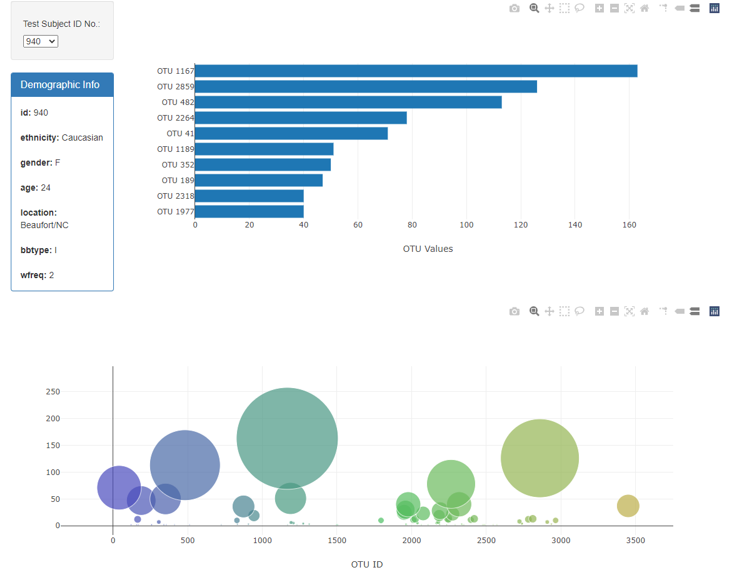
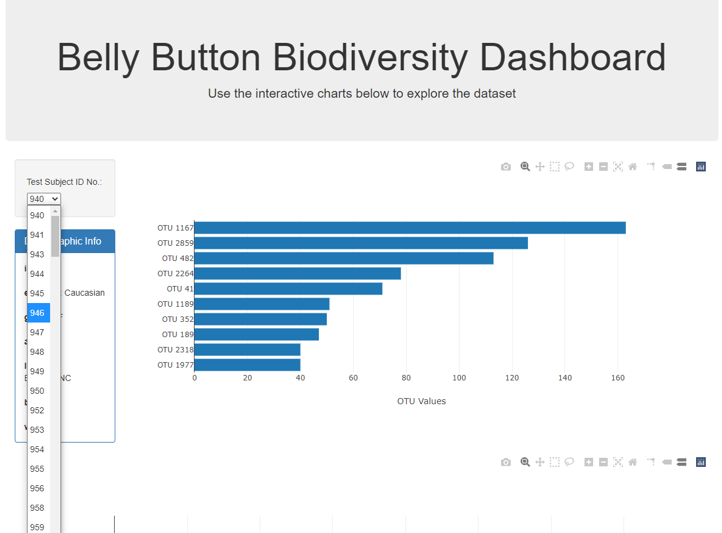

# Belly Button Biodiversity

The goal of this challenge was to build an interactive dashboard to explore the Belly Button Biodiversity Dataset, which catalogs the microbes that colonize human navels. The dataset reveals that a small handful of microbial species (also called operational taxonomic units, or OTUs, in the study) were present in more than 70% of people, while the rest were relatively rare.

### Dataset: 
[Belly Button Biodiversity Dataset](http://robdunnlab.com/projects/belly-button-biodiversity/)

## Objectives

The Plotly JavaScript Graphing Library was utilized to create the graphs: 

- Wrote in data/samples.json dataset using D3.js within the app.js file. 
- JavaScript methods were used to filter, map, slice and reverse the data to be graphed. 

The JavaScript and HTML work to gether to create interactive exploration for the user:

- Appended the dropdown option tags with the sample id information into the index.html file. 
- Used an event handler to define the user's dropdown selection from the index.html file and passed that selection value into the graphing functions.

Check out this interactive dashboard for youself at [https://hopeneely.github.io/Plotly-challenge/](https://hopeneely.github.io/Plotly-challenge/). The dropdown allows the user to select an individual test subject ID number. That selection updates the demographic information, the horizontal bar chart, and the bubble chart to show information for that individual test subject. 

## Contact Info: 
Email: [hope.neely@gmail.com](hope.neely@gmail.com) 
LinkedIn : [https://www.linkedin.com/in/hopeneely/](https://www.linkedin.com/in/hopeneely/)
